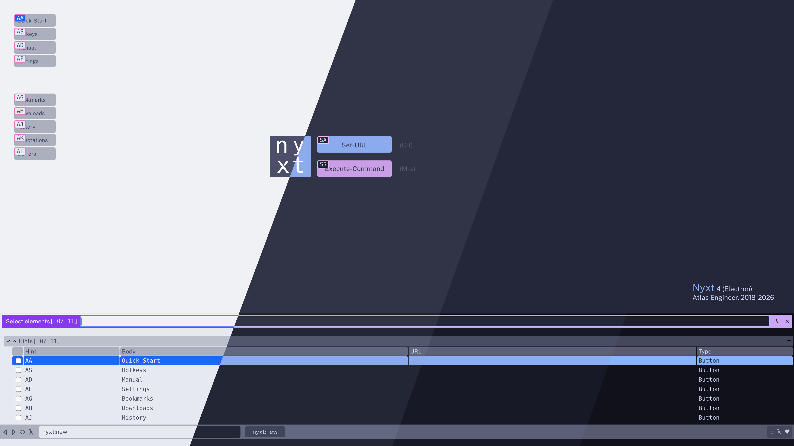

#+title: Nyxt 4 configuration
#+author: matf
#+options: toc:t num:nil

My Nyxt 4 configuration, commands, rules, and Catppuccin theme. 

#+caption: Catppuccin theme

* Structure

#+begin_src
~/.config/nyxt/
├── config.lisp                  # entry point — loads everything
├── theme/
│   ├── catppuccin.lisp          # all four flavours + runtime switcher
│   └── catppuccin-flavour.lisp  # auto-generated: stores the active flavour
└── base/
    ├── urlprompt.lisp           # search engines shortcuts
    ├── domainrules.lisp         # old-reddit-mode (redirects reddit to old.reddit)
    ├── commands.lisp            # custom commands + floating Emacsclient as external editor
    ├── nyxt-sessions.lisp       # session save/restore (third-party)
    ├── keybindings.lisp         # custom keymap
    └── glyphs.lisp              # status bar mode glyphs
#+end_src

Load order in =config.lisp= matters: =keybindings.lisp= must come before
=glyphs.lisp= so the mode classes exist before =define-configuration= tries to
configure them.

* Catppuccin themes
:PROPERTIES:
:CUSTOM_ID: catppuccin
:END:

Four [[https://github.com/catppuccin/catppuccin][Catppuccin]] flavours are defined in =theme/catppuccin.lisp=.  The
active flavour persists across session thanks to the auto-generated
=theme/catppuccin-flavour.lisp= file (do not edit manually).

** Flavours

| Variable               | Flavour   | Style |
|------------------------+-----------+-------|
| =*catppuccin-latte*=     | Latte     | light |
| =*catppuccin-frappe*=    | Frappé    | dark  |
| =*catppuccin-macchiato*= | Macchiato | dark  |
| =*catppuccin-mocha*=     | Mocha     | dark  |

** Switching flavours

Run =M-=x catppuccin-load-flavour= in Nyxt to pick a flavour interactively.  The
choice is applied immediately and written to disk so it survives restarts.

** Using the theme standalone

The theme has no dependency on anything else in this config.  To use it in your
own setup, copy =theme/catppuccin.lisp= and add to your =config.lisp=:

#+begin_src lisp
(nyxt::load-lisp "~/.config/nyxt/theme/catppuccin.lisp")
#+end_src

The flavour switcher command and the flavour-persistence file are self-contained
inside =catppuccin.lisp= and work without the rest of this config.

** Prompt buffer fix

Nyxt's default CSS sets =color= on =.source-content td= (all suggestion cells),
which overrides the inherited color from the =#selection= row rule.  This file
adds a =#selection td= override so the selected row uses the correct
=on-action-color=: light text on Latte's blue highlight, dark text on the
pastel highlights of the dark flavours.

* Keybindings

Custom bindings are active in all three key schemes (CUA, Emacs, vi-normal)
via =my-mode=, which is enabled by default on every =web-buffer=.

| Key     | Command                                 |
|---------+-----------------------------------------|
| =C-t=     | Toggle toolbars                         |
| =C-s C-s= | Search across all open buffers          |
| =C-x C-x= | Delete current buffer                   |
| =C-0=     | Delete current buffer                   |
| =C-;=     | Switch to last buffer                   |
| =C-e=     | Edit current input field in emacsclient |
| =C-x e=   | Edit a Nyxt user file in emacsclient    |
| =C-x w=   | Show weather in the message area        |
| =C-x t=   | Show current time in the message area   |
| =C-x z=   | Reopen last buffer                      |
| =C-x C-z= | Querry closed buffers to reopen         |

* External editor (emacsclient)

=C-e= opens the focused input field or textarea in an emacsclient floating
frame, then writes the saved content back into the field via JavaScript.
The command does not actually make the Emacs window floating, but it gives
it the "floating" app ID, which my Sway config recognizes and sets as
floating.

Two non-obvious design decisions are documented in =commands.lisp=:

- The =external-editor-program= *slot* cannot hold a list (which would be
  useful for complex editor commands), so the reader method is overridden
  instead to return the argument list directly.
- =ffi-buffer-paste= requires focus; a JS =el.value= assignment via the element's
  =nyxt-identifier= attribute is used instead to write back without focus.

This requires a running Emacs server (=emacs --daemon= or equivalent) and the
=emacsclient= binary in =$PATH=.  The frame name =floating= can be matched by
your window manager to apply floating rules.

This hack probably should not be required, and maybe it isn't, but I have
not found any other solution to do what I want with the built-in settings.

* Commands

** Open in external browser

| Command                 | Opens current URL in…  |
|-------------------------+------------------------|
| =open-in-firefox=         | Firefox                |
| =open-in-firefox-private= | Firefox private window |
| =open-in-chromium=        | Chromium               |
| =open-in-w3m=             | w3m (via =footclient=)   |
| =open-in-lynx=            | lynx (via =footclient=)  |

** Weather

=M-x show-weather= (or =C-x w=) fetches a one-line weather report from
[[https://wttr.in][wttr.in]] and displays it in the message area.  No shell script required; the
HTTP request is made directly with =dexador=.

** Session management

=save-session= and =restore-session= commands (from =nyxt-sessions.lisp=, by
[[https://github.com/arcensyl][Arcensyl]]) save and restore the list of open URLs to
=~/.local/share/nyxt/session=.

* URL rules

** Old Reddit redirect

=old-reddit-mode= redirects =reddit.com= to =old.reddit.com= automatically.
The mode auto-enables when you land on any Reddit page and auto-disables when
you leave, so its glyph (=r=) only appears in the status bar when relevant.
Toggle it manually with =M-x old-reddit-mode= to switch back to new Reddit
while the mode is active.

*Note for GTK users:* the redirect uses =on-signal-load-started= rather than
=request-resource-hook= because the latter is not fired by the Electron
renderer.

* Search engines

Configured in =base/urlprompt.lisp=.  The first entry in the list becomes the
default.  Use a shortcut in the URL bar (e.g. =w= for Wikipedia, =gh= for
GitHub) to search with a specific engine.

| Shortcut | Engine           |
|----------+------------------|
| =afr=      | Amazon FR        |
| =a=        | Amazon           |
| =doi=      | DOI resolver     |
| =gh=       | GitHub           |
| =imdb=     | IMDb             |
| =lns=      | Lens (scholar)   |
| =osm=      | OpenStreetMap    |
| =sp=       | Startpage        |
| =spi=      | Startpage Images |
| =wfr=      | Wikipedia FR     |
| =w=        | Wikipedia EN     |
| =17t=      | 17track          |
| =ddg=      | DuckDuckGo       |

* Status bar glyphs

Mode glyphs configured in =base/glyphs.lisp=:

| Mode             | Glyph |
|------------------+-------|
| =emacs-mode=       | λ     |
| =style-mode=       | s     |
| =help-mode=        | ?     |
| =hint-mode=        | ω     |
| =my-mode= (keymap) | ♥     |
| =old-reddit-mode=  | r     |

Hint mode also has its alphabet restricted to home-row keys: =ASDFGHJKL=.
